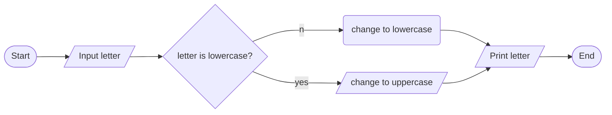

3->
input-- a letter
operation--- change the letter to upper case if it is lower or to lower if it is upper
output upper/lower case letter
pseudo code
1. start
2. input a letter
3. if the letter is lower change to upper and if it is upper change to lower
4. print the case
5. end
flow chart

