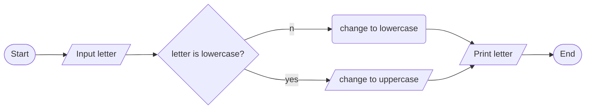
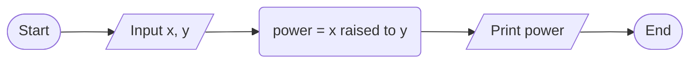
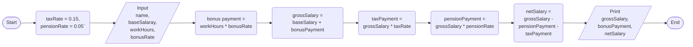

1->
// to calculate the Body mass index
input-- height and weight
operation-- BMI= weight/(heght*height)
output---- BMI of the person
pseudo code
1.start
2. input height and weight
3. BMI= weight/(height*height)
4. print BMI
5. end
flow chart


2-> 
input-- the capacity of a gallon, miles per gallon
operation-- tank moves with out refuling = the capacity of gallon *miles per gallon
output-- the total distance moved by a tank with out refuling
pseudo code
1. start
2. input the capacity in gallon and miles per gallon
3. distance= miles per gallon*capacity in gallon
4. print distance
5. end
 flow chart
 ```mermaid
graph LR;
id1([Start]);
id2[/Input capacity, efficiency/];
id3(distance = capacity * efficiency);
id5[/Print distance/];
id6([End]);
id1-->id2;
id2-->id3;
id3-->id5;
id5-->id6;
```

3->
input-- a letter
operation--- change the letter to upper case if it is lower or to lower if it is upper
output upper/lower case letter
pseudo code
1. start
2. input a letter
3. if the letter is lower change to upper and if it is upper change to lower
4. print the case
5. end
flow chart



4->  
// to calculate x raised to y by giving value from the keyboard
input---- value of x and y
operation--- value of x raised to y
output---- number which is the result of x raised to y
pseudo code
1. start
2. input value of x and y
3. x raised to y
4. print result
5. end
flow chart


5->
// calculating gross salary, bonus payment, and netsalary
input-- bonusRatePerHour, weeklyWorkingHour, baseSalary, taxRate=0.15, pensionRate=0.05
operations--- bonusPayment= bonusRatePerHour*weeklyWorkingHour
              grossSalary= bonusPayment+baseSalary
              taxPayment= grossSalary*taxRate
              pensionPayment= grossSalary*pensionRate
              netSalary= grossSalary-(taxPayment+pensionPayment)
output----- bonusPayment, grossSsalary, taxPayment, pensionPayment, netSalary
pseudo code
1. start
3. taxRate= o.15, pensionRate= 0.05
4. input bonusRatePerHour, weeklyWorkingHour, baseSalary,name
5. bonusPayment= bonusRatePerHour*weeklyWorkingHour
6. grossSalary= bonusPayment+baseSalary
7. taxPayment= grossSalary*taxRate
8. pensionPayment= grossSalary*pensionRate
9. netSalary= grossSalary- (taxPayment+pensionPayment)
10. print bonusPayment, grossSalary, netSalary
11. end
flow chart


6->
input--- characters per second = 960 bytes/second, and  size of charcter
operation-- time taken = given charcter/ charcter per second
output--- time taken to move the file
pseudo code
1. start
2. charcterPersecond= 960 bytes/second
3. input file size
4. time taken= file size/ charcter per second
5. print time taken
6. end
   flow chart
   ```mermaid
graph LR;
id1([Start]);
id3(characterPersecond = 960);
id2[/Input file size/];
id7(timeTaken = file size / characterPersecond);
id5[/Print timeTaken/];
id6([End]);
id1-->id3;
id7-->id5;
id3-->id2;
id2-->id7;
id5-->id6;
```

          

