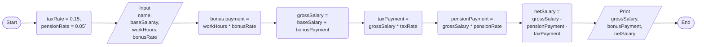

5->
// calculating gross salary, bonus payment, and netsalary
input-- bonusRatePerHour, weeklyWorkingHour, baseSalary, taxRate=0.15, pensionRate=0.05
operations--- bonusPayment= bonusRatePerHour*weeklyWorkingHour
              grossSalary= bonusPayment+baseSalary
              taxPayment= grossSalary*taxRate
              pensionPayment= grossSalary*pensionRate
              netSalary= grossSalary-(taxPayment+pensionPayment)
output----- bonusPayment, grossSsalary, taxPayment, pensionPayment, netSalary
pseudo code
1. start
3. taxRate= o.15, pensionRate= 0.05
4. input bonusRatePerHour, weeklyWorkingHour, baseSalary,name
5. bonusPayment= bonusRatePerHour*weeklyWorkingHour
6. grossSalary= bonusPayment+baseSalary
7. taxPayment= grossSalary*taxRate
8. pensionPayment= grossSalary*pensionRate
9. netSalary= grossSalary- (taxPayment+pensionPayment)
10. print bonusPayment, grossSalary, netSalary
11. end
flow chart

