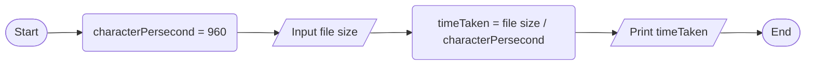

6->
input--- characters per second = 960 bytes/second, and  size of charcter
operation-- time taken = given charcter/ charcter per second
output--- time taken to move the file
pseudo code
1. start
2. charcterPersecond= 960 bytes/second
3. input file size
4. time taken= file size/ charcter per second
5. print time taken
6. end
   flow chart

