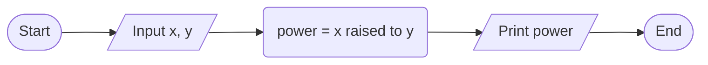

4->  
// to calculate x raised to y by giving value from the keyboard
input---- value of x and y
operation--- value of x raised to y
output---- number which is the result of x raised to y
pseudo code
1. start
2. input value of x and y
3. x raised to y
4. print result
5. end
flow chart

